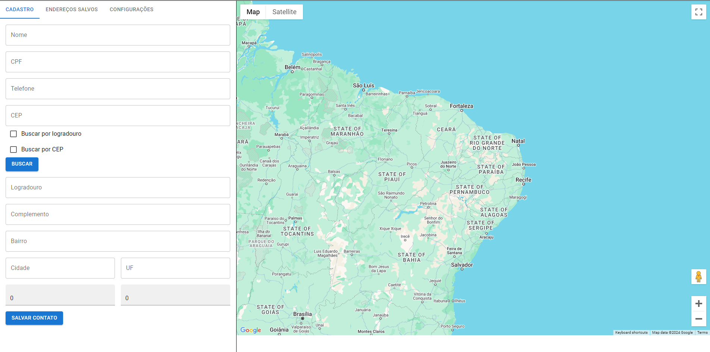
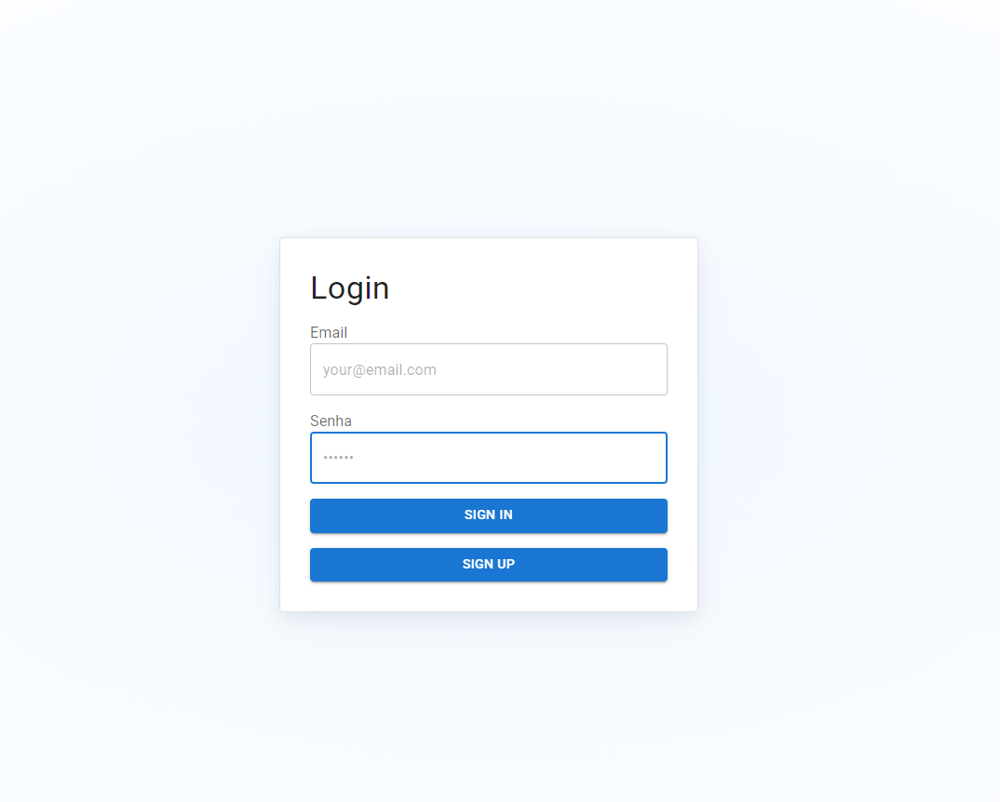
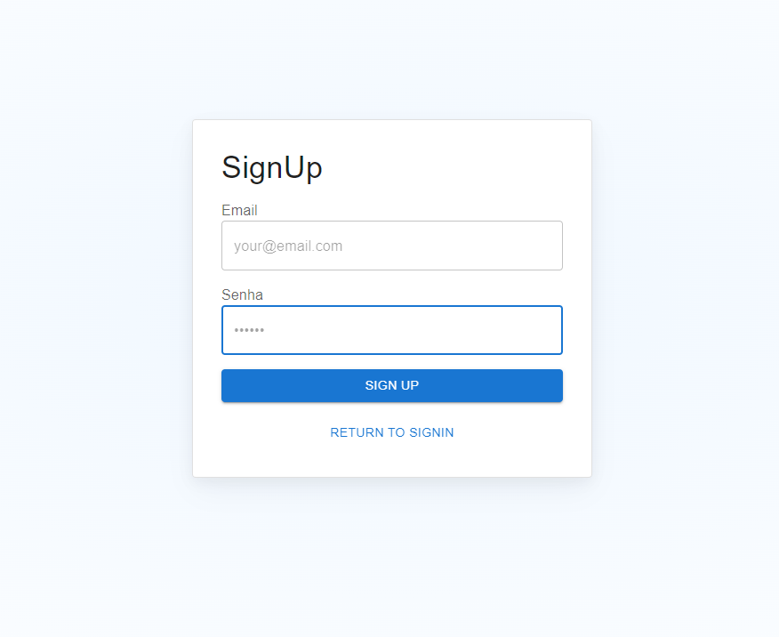
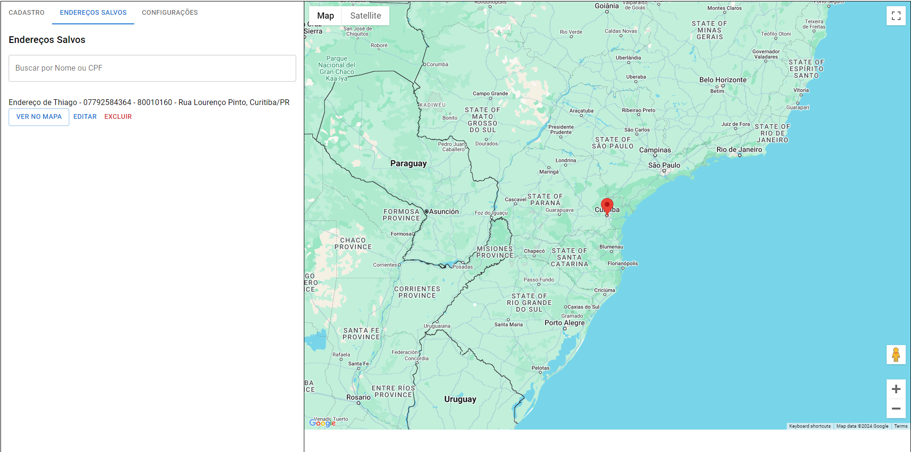

# Maps with React + Vite

This project is a technical test showcasing a React application built with modern tools and libraries, integrating map functionality for an interactive user experience.

## Features

- **React**: A powerful library for building dynamic and responsive user interfaces.
- **Vite**: A fast and modern build tool and development server.
- **Material-UI**: For creating elegant and consistent user interfaces.
- **Google Maps Integration**: Powered by the `@react-google-maps/api` library for displaying interactive maps.
- **Via CEP Integration**: Consuming public API for CEP

## Getting Started

### Prerequisites

Ensure you have the following installed:

- **Node.js** (v16 or higher recommended)
- **Yarn** or **npm** for dependency management
- **Github CLI** for clone project

### Installation

1. Clone the repository:
   ```bash
   gh repo clone ThiagoAlencar12/maps-with-react
   cd maps-with-react
   ```

2. Install the dependencies:
   ```bash
   yarn install
   # or
   npm install
   ```

### Running the Application

To start the development server:
```bash
yarn dev
# or
npm run dev
```

Access the application in your browser at `http://localhost:3000` (default port).

## Project Structure

```plaintext
src/
├── app/             # Application logic
│   ├── context/     # Context providers
│   ├── Router/      # Routing configuration
│   └── services/    # API calls and services
├── views/           # UI and functionalities
│   └── pages/       # Application pages
```

## Libraries and Tools

- **React**: Frontend library for building UI components.
- **Vite**: Modern build tool for optimized development and production workflows.
- **Material-UI**: UI library for building accessible and customizable components.
- **@react-google-maps/api**: A lightweight wrapper around the Google Maps JavaScript API for React integration.

## Google Maps Setup

1. Obtain a Google Maps API key from the [Google Cloud Console](https://console.cloud.google.com/).
2. Create a `.env` file in the root directory and add the following:
   ```env
   VITE_GOOGLE_MAPS_API_KEY=your_api_key_here
   ```
3. Restart the development server to load the new environment variables.

## Contact

For any inquiries, reach out to the project maintainer at [Email](thiagofalencar12@gmail.com).

## Exemples






